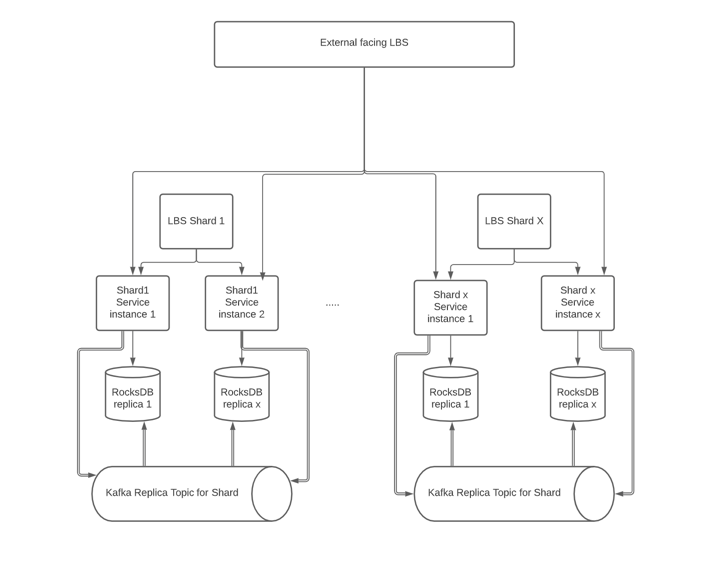

##### **NotADB**

**What is NotADB**

Literally, it is not a db. It is a framework to help build a distributed *stateful* services, which helps below:
1. Queries a lot of data to retrieve simple answer (eg. analysis, personalization search, real-time aggregation)
2. Query is strictly partition based (eg. same zone, same store, same prefix range)
3. Write is less heavy than read (can be tuned, but still prefer less heavy write than read)
4. Requires low latency in query. 

Thanks to *RocksDB*, it makes process build-in db possible. Thanks to *Kafka*, I can achieve master-master replication in a cheap way.

**Architecture**

1. The service are sharded by customizable sharding rule, eg. key, key prefix
2. Each service shard, or service group contains multiple instances
3. All instances are exposed to one shared external shared LBS
4. Each shard group has its own LBS for routing purpose
5. A query comes to from external LBS can result in two scenarios:
    a) the current instance can handle this request locally, request is then handled properly 
    b) it needs to be handled by shard x, then the request is route to LBS shard x
6. The read query is always served by corresponding shard service instance with its local data 
7. The write query is async. It is always published to corresponding kafka topic and then got consumed by all sharding service instances to achieve data replication

**FAQ**

1. What's external facing transport?
Right now only support GRPC

2. How to scale?
I am not implementing consistent hashing. But within one shard, RocksDB supports backup. We can use backup file to spin up new instances easily.
As we are replicating from kafka, the new instance might need to catch up the queue from copied offset. Before catching up, we set k8s probe api not available. 

3. Have you heard about ClickHouse?
Yes, in some sense, the goal is similar: being able to handle big data based query in a faster way. 

4. Why do you write similar stuff?
I am bored. Also, the NotADB provides: 
a) more flexible partition
b) customized sorting 
c) computation and data IO happens on same process 
It can easily handle below scenario:
key:{store_id}-{product}|{score}|{item_id} 
value: object 

You can customize to indicate: partition all store_id to same group, sort according to group and score. Because data is sorted on RocksDB, it is easy to answer below question:
What's the available items for the given store and product 

key: {user-id} | {timestamp} | {feature_name} 
value: object
answer: what's the most viewed items in past 1 hours for this user? what's the continuously viewed items in past 30 minutes? 
or, in past 15 minutes, user's effective search. (look at feature = searched index and look at feature = click)

Anyway, it does not enforce you conform with SQL and let you define what you want. 

5. What about write
The write is handled async. So, if you are looking for write and read, it is not a proper solution for you. 

